  

I build **AI agents that actually operate inside products**, not chatbots. I also build the system around them: what they can access, what they're allowed to do, how actions run, and what happens when they fail.

I'm an **AI Product Engineer at Qik Office** in Chennai. I usually own things end to end: product idea → UI → backend → AI → infra → deployment → security → customer feedback → next iteration.

---

### ⚙️ Now

**At Qik**, since Aug 2024 (started as an intern)
- Production agent infrastructure with **115+ tools**, MCP / tool-calling, context handling, permissions and failure handling on real product data
- Meeting intelligence, Zoom / Google Meet bots, AI Project Manager concepts, long-running workflows
- Backend APIs, browser extensions, cross-platform apps, and Kubernetes infra across **~18 services**
- Worked on-site with a well-known VFX studio to fit the product to their workflow and security needs: IP-based login, upload and screen-share restrictions, access controls

**On my own**, building [**MINOS**](https://github.com/mks2122/minos) 🗝️

> A desktop agent that can't do anything you didn't allow, and can undo what it did.

A capability-scoped runtime that gives agents controlled access to the filesystem, processes, network and GUI, with permissions, checkpoints, undo, verification, audit trails, sandboxing and execution tiers.
`Alpha` · `18-task eval suite` · `755 tests passing` · `runs 100% offline`

---

### 🧭 Other things I build

| | |
|---|---|
| 🌾 **Natural-farming platform** | Freelance. Farmer education, one-year enrollment & follow-up, crop e-commerce/delivery, farmer and payment dashboards |
| 👕 **Clothing e-commerce store** | Freelance. Full storefront plus the back office behind it: payments dashboard, CRM, CMS and admin tools |
| 🧽 **Cleaning service site** | Freelance. A small business site with WhatsApp automation for handling enquiries and bookings |
| 🏭 **Keel** | An operational layer for manufacturing that gradually replaces parts of legacy ERP workflows |

I also do a lot of creative work: AI image generation, visual storytelling and creative direction. I like taking something that only exists as text and turning it into something you can see or click through.

---

### 🛠️ Toolbox

  

`AI agents` · `agentic workflows` · `MCP & tool calling` · `LLM apps` · `backend & APIs` · `full-stack` · `Kubernetes & infra` · `product architecture`

---

### 🎓 Background

B.Tech, Artificial Intelligence & Machine Learning, **St. Joseph's College of Engineering** (2026) · GPA 8.68/10

Off the keyboard: motorcycles 🏍️, product design, and figuring things out myself.

---

  <b>Open to roles in AI products, agents and AI-native applications.</b> 
  Interested? Read my <a href="Karthick_Sriram_Resume.pdf">resume</a> or get in touch 👇  
  
  
  
  

